

## Kontext und Idee

Im Rahmen des Wahlpflichtmoduls "Cross-Plattform Development mit Flutter" im Wintersemester 2021/2022 der Hochschule Mannheim wurden die Grundkonzepte an theoretischen und praktischen Beispielen über mehrere Vorlesungen hinweg vorgestellt. Neben der Vorlesung gehörte es zu diesem Modul dazu, eine App basierend auf der Technologie Flutter zu implementieren.  
Die mobile Anwendung, um die es in diesem Dokument handelt, wurde in Kooperation mit dem „Toni Kroos Academy“-Team entwickelt. Passend dazu wurden einige Wireframes und Anforderungen zur Verfügung gestellt, die als Grundlage genutzt werden konnten. Dementsprechend handelt es sich bei dieser Anwendung um eine Nachbildung der bestehenden Anwendung “Toni Kroos Academy“, bei der es an einigen nützlichen Funktionalitäten fehlte. Insbesondere wurde der Video Player im Hinblick auf Benutzerfreundlichkeit und Performance erheblich verbessert und um Funktionen erweitert, worum es in dieser Dokumentation hauptsächlich geht.

Dieses Dokument beschreibt hierzu grundlegende Funktionen dieser App, vor allem die des Video Players und stellt die Unterschiede zur bestehenden Toni Kroos Academy-App dar. Dabei wird an einigen Stellen auf technische Details eingegangen. Zudem werden einige Design-Entscheidungen aufgeführt, die für mögliche Leser bei ihrer Entwicklung sich als nützlich erweisen könnten.

## Video vom Durchlauf

## Screens

**_Zum Vergrößern draufklicken_**

<table>
   <tr>
      <td>
         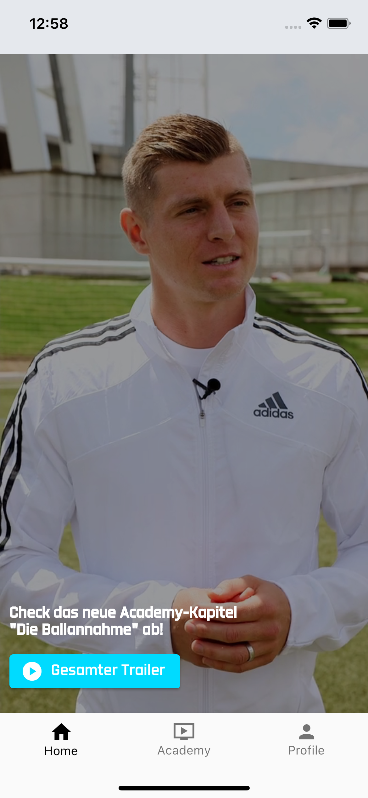
      </td>
      <td>
         
      </td>
      <td>
         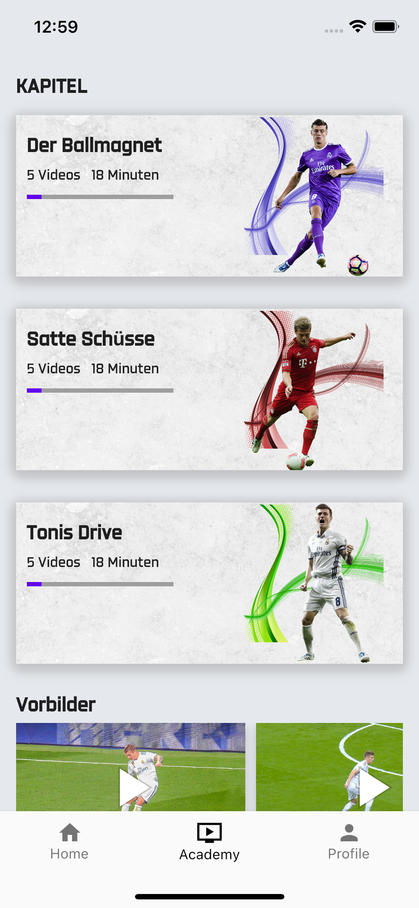
      </td>
   
   <td>
         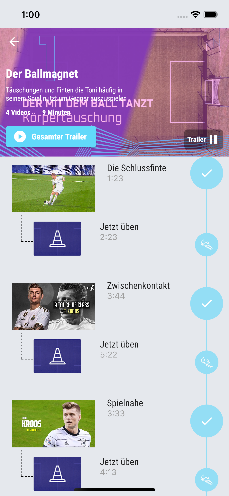
      </td>
       <td>
         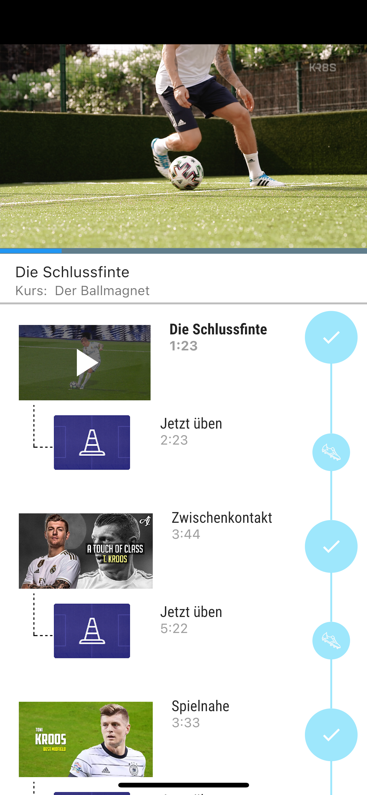
      </td>
      <td>
         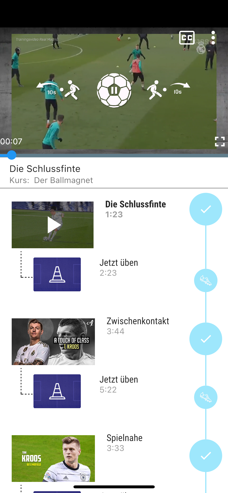
   </td>
      
   </tr>
 
   </table>
   <table>
   <tr>
      <td>
         
      </td>
       <td >
         
      </td>
        <td >
         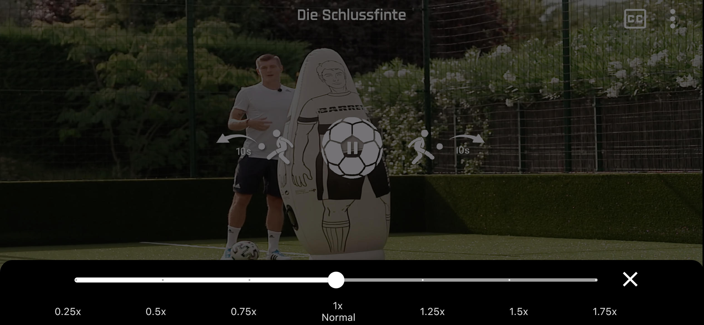
      </td>
      </tr>
     
   <tr>
     
   <td>
      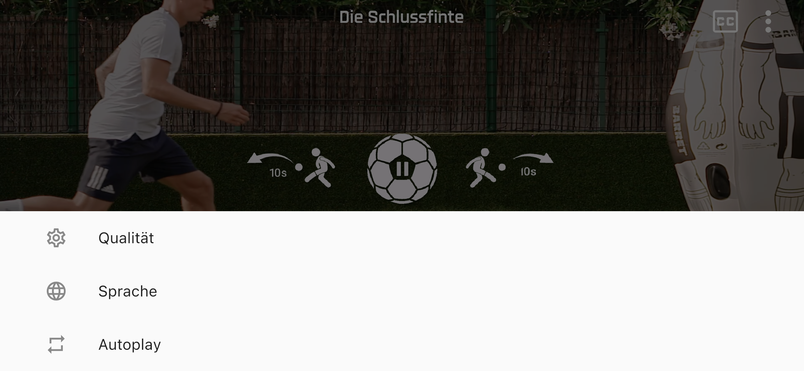
   </td>
   <td>
      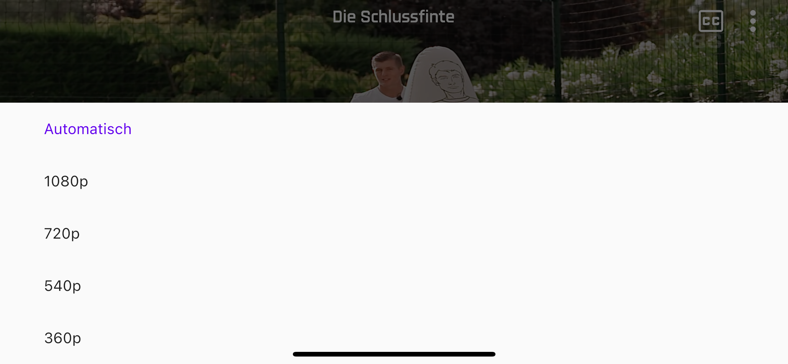
   </td>
   <td>
      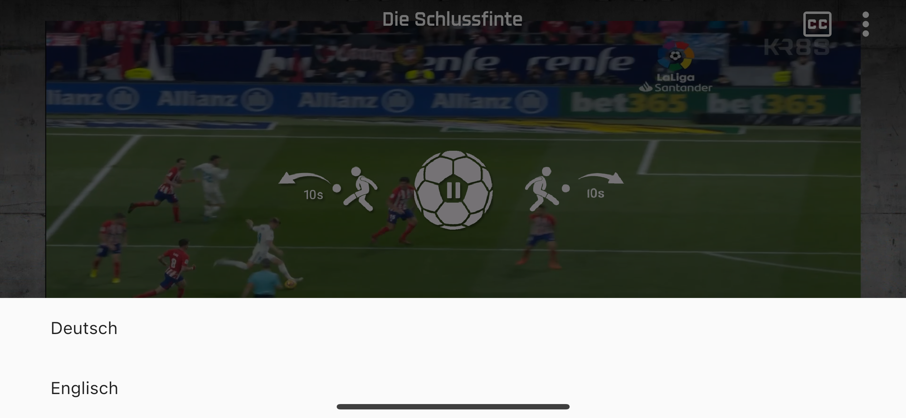
   </td>
   </tr>
   <tr>
      <td>
     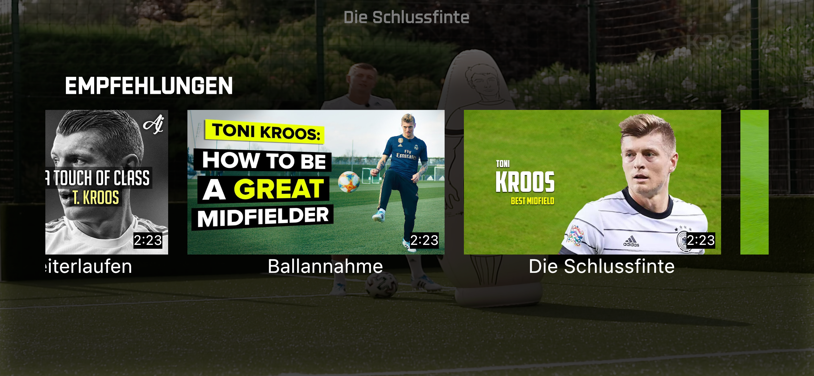
      </td>
       <td >
       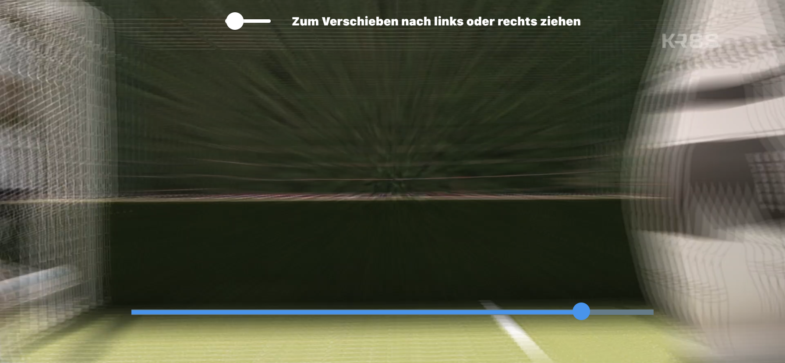
      </td>
       <td >
        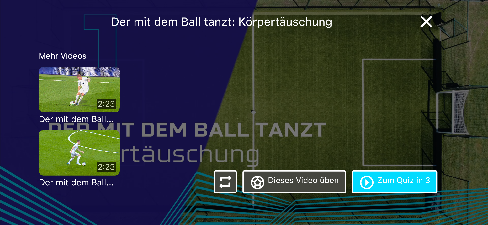
      </td>
      </tr>
        <tr>
        
   <td >
        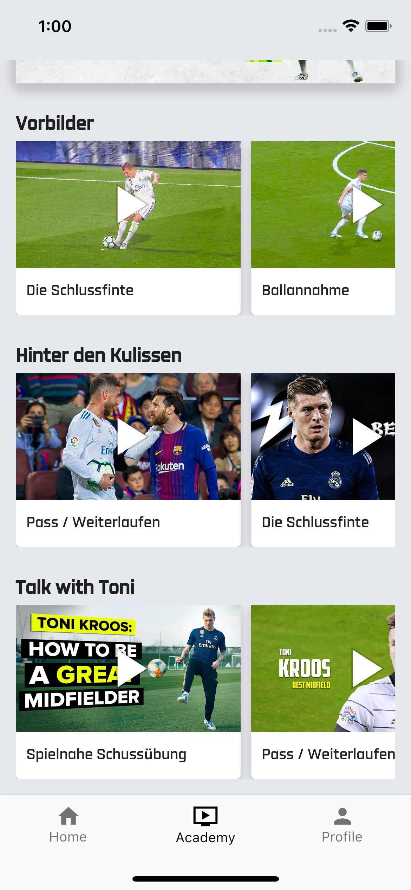
   </td>
   <td>
        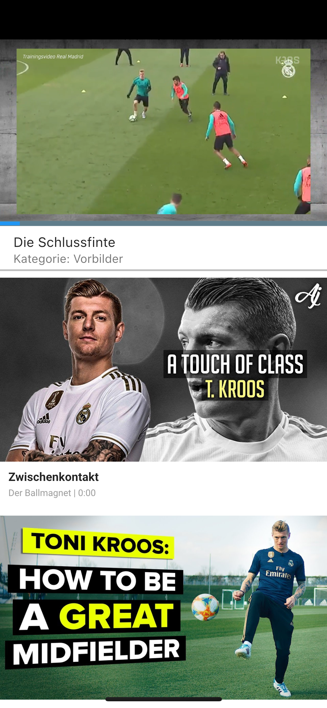
   </td>
</tr>
</table>

## Features

&nbsp;✔️ &nbsp;&nbsp;&nbsp;Start/Pause- Funktionalität 
&nbsp;✔️ &nbsp;&nbsp;&nbsp;Forward and Backward- Funktionalität 
&nbsp;✔️ &nbsp;&nbsp;&nbsp;Forward und Backward per Doppeltap möglich, wenn UI-Elemente ausgeblendet sind 
&nbsp;✔️ &nbsp;&nbsp;&nbsp;Untertitel einblenden ausblenden 
&nbsp;✔️ &nbsp;&nbsp;&nbsp; Sprachauswahl (Englisch, Deutsch) 
&nbsp;✔️ &nbsp;&nbsp;&nbsp; Videoqualität ändern 
&nbsp;✔️ &nbsp;&nbsp;&nbsp;Videogeschwindigkeit ändern über Slider (im Portrait über Menü wählbar, im Landscape direkt über Icon) 
&nbsp;✔️&nbsp;&nbsp;&nbsp; Ein-/Ausblenden von UI-Elementen 
&nbsp;✔️ &nbsp;&nbsp;&nbsp;Automatisches Ausblenden der UI-Elemente nach gewisser Zeit 
&nbsp;✔️ &nbsp;&nbsp;&nbsp;Progressbar zum Ändern der Position im Video 
&nbsp;✔️&nbsp;&nbsp;&nbsp; Videoposition per Longpress bestimmbar 
&nbsp;✔️&nbsp;&nbsp;&nbsp; Portrait und Landscape Modus (falls Rotation im System eingeschaltet) 
&nbsp;✔️&nbsp;&nbsp;&nbsp; Auswahl von weiteren Videos in Form einer Liste im Portrait-Modus 
&nbsp;✔️ &nbsp;&nbsp;&nbsp;Empfehlungen in Form von einem Bottom Sheet (nur im Landscape-Modus möglich) 
&nbsp;✔️&nbsp;&nbsp;&nbsp; Das Schließen des aktuell offenen Videos im Portrait-Modus, indem nach unten geswipt wird 
&nbsp;✔️ &nbsp;&nbsp;&nbsp;Das Video erneut anschauen, nachdem Video das Ende erreicht hat 
&nbsp;✔️ &nbsp;&nbsp;&nbsp;Auswahl anderer Videos , nachdem das Video das Ende erreicht hat (nur im Landscape-Modus) 
&nbsp;✔️&nbsp;&nbsp;&nbsp; Dark-Mode und Light-Mode wechseln 

#### Ausblick:

- Videos favorisieren
- Videos teilen über soziale Medien
- Chromcast auf verschiedenen Endgeräten
- Benutzerauthentifizierungsmechanismus
- Bewertungen von Videos
- Kommentar-Funktion

## Tech Stack

Frontend : **Flutter (Programmiersprache: Dart)**

Backend: **Node.js**

- Middleware-Schnittstelle: **Express.js**
- Ist ein **HTTP Live Streaming Server(HLS)**, der Antwort vor dem Senden komprimiert
- [**Mediastreamvalidator**](https://developer.apple.com/library/archive/documentation/NetworkingInternet/Conceptual/StreamingMediaGuide/UsingHTTPLiveStreaming/UsingHTTPLiveStreaming.html#:~:text=Media%20Stream%20Validator) vom Apple für Performance-Bewertung unseres HLS- Servers
- Gehostet wird das Backend auf [**Heroku**](https://www.heroku.com/home)
- **HLS** Format für adaptive Bitrate-Streaming

## Übersicht Architektur

 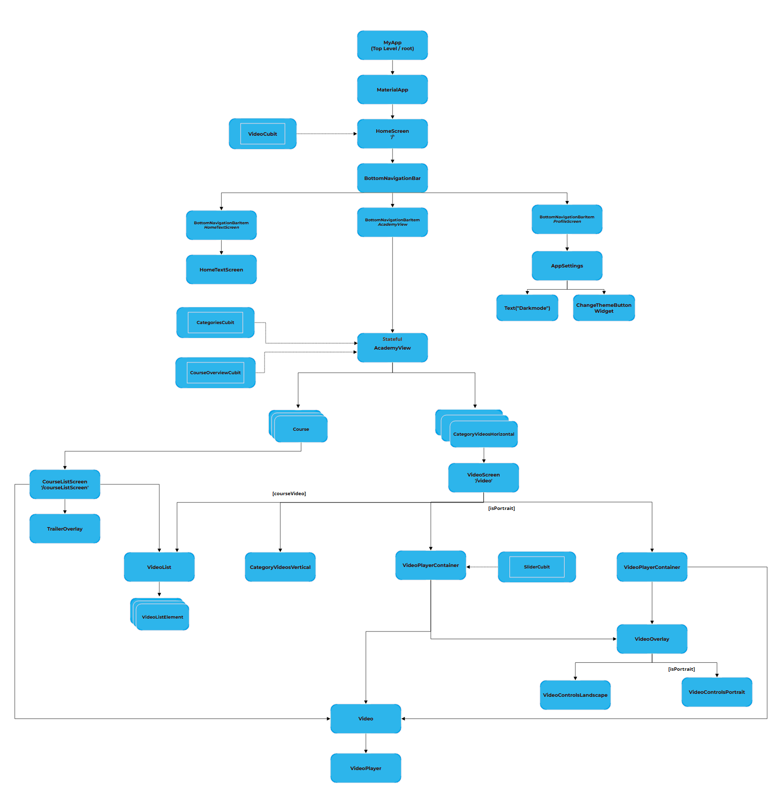
 
### Anmerkung - Automatische Rotation Landscape/ Portrait Modus:
   Die Ausrichtungssperre muss auf dem Emulator/ Device deaktiviert werden, damit eine automatische Rotation erfolgen kann.

## Bugs in verwendeten Packages

#### Automatische Orientierung Landscape/ Portrait:

- Die Rotation von Portrait zu Landscape und umgekehrt funktioniert manchmal nicht ordnungsgemäß auf dem Emulator. 
  Jedoch treten die Probleme auf einem echten IOS/Android Device nicht auf.

#### Flutter Plugin video_player:

- Beim Flutter Plugin “video_player“ kommt es manchmal mit den darunterliegenden Videoplayern von IOS (AVPlayer) und Android (ExoPlayer) zu einer Race Condition.  Beim Auftreten des Bugs wird der Videoplayer nicht initialisiert und das Video startet nicht. Das Neustarten des Simulators behebt oftmals das Problem. Siehe Github Issue: https://github.com/flutter/flutter/issues/21483

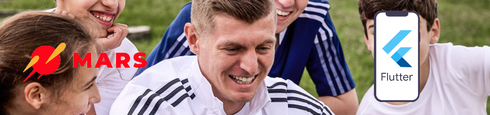
